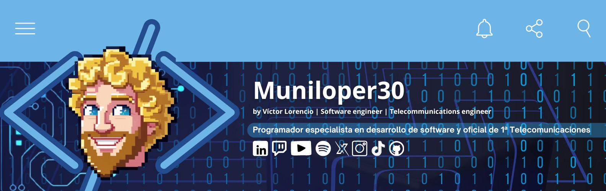

#  Hola, Bienvenido al GitHub de Víctor Lorencio 👋

### Creación y maquetación de páginas web | Desarrollo Front-end | Gestión y creación de contenidos en redes sociales | Html y Css | JavaScript | React |Reparación de equipos electrónicos.

# 💫 About Me:
#### Ingeniero de Telecomunicaciones con una sólida experiencia en resolución de problemas y atención al cliente adquirida durante mi tiempo como técnico de reparaciones en Nintendo.
#### Decidí dar un giro a mi carrera y sumergirme en el apasionante mundo de la programación. Combino mis conocimientos técnicos con mi habilidad para aprender rápidamente nuevas tecnologías para crear soluciones eficientes y de alta calidad.
#### Actualmente, estoy en constante aprendizaje de diversas tecnologías y lenguajes de programación, con el objetivo de expandir mis habilidades y convertirme en un profesional versátil del sector. Mi intención es contribuir a proyectos innovadores y aportar valor a los equipos de desarrollo.

## 🌐 Socials:
     

# 💻 Tech Stack:
                          
# 📊 GitHub Stats:
 
 

## 🏆 GitHub Trophies

### 🔝 Top Contributed Repo

---

<!-- Proudly created with GPRM ( https://gprm.itsvg.in ) -->

<!--

Here are some ideas to get you started:

- 🔭 I’m currently working on ...
- 🌱 I’m currently learning ...
- 👯 I’m looking to collaborate on ...
- 🤔 I’m looking for help with ...
- 💬 Ask me about ...
- 📫 How to reach me: ...
- 😄 Pronouns: ...
- ⚡ Fun fact: ...
-->
